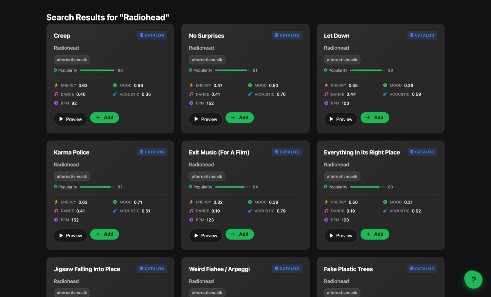
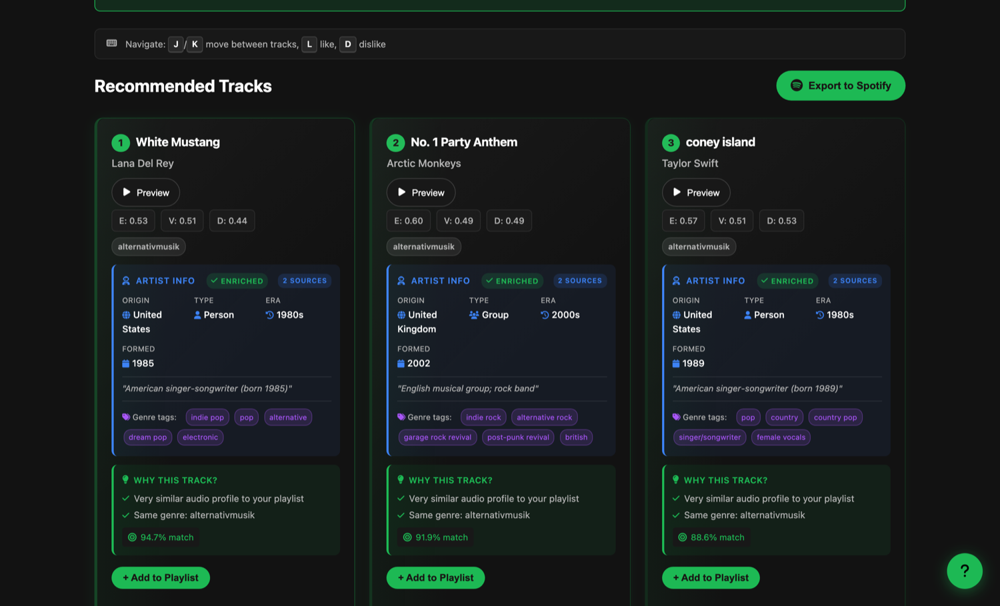

<p align="center">
  
</p>

# NextTrack

**A content-based music recommendation platform that measures the audio itself. Django, real-time WebSocket search, and a from-scratch recommendation engine over feature vectors extracted with DSP.**

NextTrack recommends songs by the *sound* of the music rather than by collaborative "people who liked X also liked Y" signals. Every track is reduced to a normalised 5-dimensional audio-feature vector (valence, energy, danceability, acousticness, tempo), and recommendations are the tracks closest to the centre of your seed playlist, refined with session feedback, serendipity injection, and enrichment from several public music APIs.

The distinguishing part is where those numbers come from. They are **not** fetched from a music-intelligence API — that API was deprecated. NextTrack downloads each track's 30-second preview clip and computes the vector itself with librosa: beat tracking, harmonic/percussive source separation, spectral shape, and Krumhansl-Schmuckler key detection. You can play the same clip in the browser, so what you hear is exactly what the recommender measured.

It is built as a production-shaped Django application: an ASGI stack (Daphne + Channels) for real-time search over WebSockets, Celery + Redis for background work, PostgreSQL for storage, a versioned REST API with OpenAPI docs, and Docker Compose for one-command local setup.

**It runs with no API credentials of any kind.** Search uses Deezer's public API; audio features are computed locally. Clone it, `docker compose up`, and search works.

> This is the largest system I have built end to end. The README below is written so you can stand it up and read the interesting parts quickly.

---

## Highlights

- **Content-based recommendation engine written from scratch** (NumPy, no ML black box): feature-vector extraction, centroid computation, adaptive centroid shifting from like/dislike feedback, explicit preference blending, serendipity injection to avoid filter bubbles, and Euclidean-distance ranking. See [`catalog/services.py`](catalog/services.py).
- **Audio features computed from the audio itself**: valence, energy, danceability, acousticness and tempo are extracted from each track's 30-second preview clip with librosa — beat tracking, harmonic/percussive separation, spectral shape and chroma key detection. No third-party feature API is involved, which is what makes "recommends by the sound of the music" literally true. See [`catalog/audio_analysis.py`](catalog/audio_analysis.py) and the [method and calibration notes](docs/NOTES.audio-features.md).
- **Honest about its own numbers**: tempo and loudness are *measured*; energy, danceability and acousticness are *estimated* from weighted descriptors calibrated against a reference corpus spanning solo piano to hard techno; valence is documented as a **heuristic** and the weakest of the five, because musical positiveness is not recoverable from DSP alone. The notes say so explicitly rather than presenting all five as equally solid.
- **In-browser previews**: every result, playlist entry and recommendation plays the same clip the analyser measured — so the feature vector is audible, not just a number. Clip URLs are signed and short-lived, so they are fetched fresh on play and cached server-side.
- **Real-time search over WebSockets**: as you type, a Channels consumer streams phased progress updates ("searching local database…", "querying Deezer…", "ranking results…") and merges local catalogue hits with live provider results. See [`catalog/consumers.py`](catalog/consumers.py).
- **Hybrid catalogue with no credentials required**: searches the local PostgreSQL library first, then the Deezer public API, ingesting new tracks on demand so the searchable catalogue grows as it is used. Deezer needs no API key, no dashboard app and no subscription.
- **External enrichment with graceful degradation**: artist metadata, similar artists, influence chains, and tags are pulled from MusicBrainz, Wikidata, Last.fm, and Genius. Every external call goes through a retry-with-exponential-backoff helper, and every client degrades to a no-op when its API key is absent or the service is down. The core recommender keeps working regardless.
- **Interactive visual explorations of the audio-feature space**: a scatter-plot explorer, mood-journey builder, track comparison view, and genre-lineage map, all backed by dedicated API endpoints.
- **Operational surface**: liveness/readiness health probes, a Prometheus-format `/metrics/` endpoint, request-ID logging middleware, per-scope API rate limiting, a content-security-policy middleware, and scheduled Celery Beat jobs for cache warming and data harvesting.
- **257 automated tests** across unit, integration, API, web, and audio-analysis layers, plus performance benchmarks and a Locust load-test file.

---

## What it looks like

**Search** — every result carries its measured feature vector and a 30-second preview of the exact audio that produced it:



**Recommendations** — ranked by distance from your playlist's centroid, with per-track explanations, match scores, and artist enrichment from MusicBrainz/Wikidata/Last.fm:



---

## Architecture

```
                        ┌───────────────────────────────────────────┐
   Browser  ── HTTP ───►│  Daphne (ASGI)                            │
            ── WS ─────►│   ├── Django views + DRF REST API         │
            ── audio ──►│   └── Channels SearchConsumer (ws/search) │
                        └───────────┬───────────────┬───────────────┘
                                    │               │
                         ┌──────────▼──────┐  ┌─────▼───────────────┐
                         │  PostgreSQL     │  │  Redis              │
                         │  (catalogue,    │  │  (cache, Channels   │
                         │   feature       │  │   layer, Celery     │
                         │   vectors,      │  │   broker/results)   │
                         │   feedback)     │  │                     │
                         └─────────▲───────┘  └─────┬───────────────┘
                                   │                │
                    writes vectors │      ┌─────────▼────────────┐
                                   └──────┤  Celery worker + Beat │
                                          │                       │
                                          │  ┌─────────────────┐  │
                                          │  │ AUDIO ANALYSIS  │  │
                                          │  │ download clip   │  │
                                          │  │ → librosa DSP   │  │
                                          │  │ → 5D vector     │  │
                                          │  └────────┬────────┘  │
                                          └───────────┼───────────┘
                                                      │ 30s preview clip
             ┌────────────────────────────────────────▼──────────────────────┐
             │  External APIs                                                │
             │  Deezer  ── search + preview clips (no credentials needed)     │
             │  MusicBrainz · Wikidata · Last.fm · Genius ── enrichment, all   │
             │  optional and all degrade to no-ops when absent                │
             └───────────────────────────────────────────────────────────────┘
```

### How a track becomes a recommendation

The full path, which is the part worth reading:

1. **Search** hits PostgreSQL first. Anything already known comes back immediately with its measured vector.
2. **Miss → Deezer.** Unknown queries go to Deezer's public API. Matching tracks are written to PostgreSQL straight away with placeholder features and a `pending` badge, and a Celery job is queued. Search never blocks on analysis.
3. **Analysis** runs on the worker: download the 30-second preview, decode it, and derive the five dimensions with librosa. Takes roughly 7–10s per track. The result is written back and stamped with `analysis_version`.
4. **The page updates itself.** It polls `/ajax/track-features/` while any card is still pending and swaps the real numbers in as they land.
5. **Recommendation.** Only analysed tracks are candidates — a placeholder vector sits at the centre of the feature space and would otherwise be recommended for looking average. Ranking is Euclidean distance from the playlist centroid.
6. **Listen.** Each card plays the same clip that was analysed, fetched fresh at play time because Deezer signs preview URLs with a ~24h expiry.


### Real-time search flow

1. The browser opens a WebSocket to `ws/search/` and sends a query.
2. `SearchConsumer` validates and sanitises the input, then streams status updates as it works through four phases: init → local DB search → provider search + ingest → merge & rank.
3. Local and provider results are merged, de-duplicated by `(title, artist)`, ranked by a relevance heuristic (exact/prefix/substring matches, then popularity), and the top 20 are serialised back with `live` / `catalog` / `pending` / `limited` source badges.
4. Newly ingested tracks carry placeholder features and a `pending` badge until a Celery task has analysed their preview clip, which usually lands within seconds. Search never waits on analysis.

### Recommendation pipeline

Implemented in [`catalog/services.py`](catalog/services.py). The module docstring documents the constants and each stage:

1. **Feature extraction.** Each track → normalised `[valence, energy, danceability, acousticness, tempo/200]` vector.
2. **Centroid computation.** The mean of the seed-playlist vectors is the user's current taste centre.
3. **Adaptive centroid shift.** Like/dislike feedback nudges the centroid toward liked tracks and away from disliked ones.
4. **Preference blending.** Explicit per-feature preferences from the request are averaged into the target vector.
5. **Candidate selection with serendipity.** Roughly 80% genre-matched candidates, ~20% popular tracks from outside those genres to avoid filter bubbles.
6. **Euclidean-distance ranking.** Candidates ranked by L2 distance to the target vector.
7. **Categorical re-ranking.** Boosts and penalties from learned genre / country / artist-type / decade preferences.
8. **External-data enhancement.** Similar-artist, influence-chain, and Last.fm tag-match boosts.

Deterministic inputs are cached for 24 hours, and popular recommendations are pre-materialised by a nightly Celery task.

---

## Design notes

### Why the audio is analysed locally

The five feature dimensions originally came from Spotify's `/audio-features` endpoint. That endpoint was deprecated on 2024-11-27 and now returns `403` to any app without a quota extension granted before that date, so newly ingested tracks were being stored with neutral `0.5` placeholders.

That is worse than it sounds. The recommender ranks by Euclidean distance from a playlist centroid, and a set of identical vectors is equidistant from *every* centroid — those tracks were not badly ranked, they were unrankable. Computing the vector from audio removes the dependency and makes the project's central claim literally true.

### Why librosa and not Essentia

Essentia is the better DSP library for this and is close to what the original values were derived from. It publishes **no linux-aarch64 wheel on any release**, so it cannot be installed in a container on Apple Silicon — the development target. The alternatives were emulating x86 for every analysis job or building from source in the image; neither was worth it for a background job on a 30-second clip. librosa is pure Python over NumPy/SciPy/numba and every package in the chain has an aarch64 wheel. `catalog/audio_analysis.py` keeps the backend behind a seam so an Essentia path can be added for x86-only deployments.

### Why search still hits the database first

The local-first "hybrid" search predates the provider switch, but it matters *more* now, for a different reason than it was designed for.

It was originally a fallback: a curated catalogue with an external API as top-up. It is now the **system of record for the feature vectors**. No provider will give you these numbers — NextTrack derives them — so they have to be persisted, and the recommender can only ever rank over rows that exist locally. The database is not a cache of someone else's catalogue; it is the only place the analysis results live.

The practical effect is a catalogue that populates itself. Anything anyone searches for is ingested, analysed once, and permanently available to the recommender for every later visitor. A cold search costs one API round trip plus background analysis; every subsequent search for that track is a local query.

### Why analysis never blocks search

Extraction takes 7–10 seconds per track, which is unacceptable inline. Tracks are therefore saved immediately with placeholders and analysed on the Celery worker, with the page polling for the real values. The cost of that choice is a visible `Analyzing` state, which is why the front end updates in place rather than leaving stale placeholders on screen.

---

## Tech stack

| Layer | Technology |
|---|---|
| Web / API | Django 4.2, Django REST Framework, drf-spectacular (OpenAPI) |
| Real-time | Django Channels 4, Daphne (ASGI), channels-redis |
| Async / scheduling | Celery 5, Celery Beat, Redis |
| Data | PostgreSQL, NumPy + pandas (feature maths / CSV ingest) |
| Audio DSP | librosa, soundfile, numba (feature extraction from preview clips) |
| Infra | Docker, Docker Compose, Nginx, WhiteNoise, gunicorn/uvicorn |
| Quality | pytest, factory-boy, ruff, coverage, bandit, pip-audit, Locust |

---

## Quickstart (Docker)

Prerequisites: Docker and Docker Compose.

```bash
git clone https://github.com/callan-jackson/NextTrack.git
cd NextTrack

# Create your local environment file and generate a secret key
cp .env.example .env
python -c "from django.core.management.utils import get_random_secret_key; print(get_random_secret_key())"
#   ^ paste the output into SECRET_KEY in .env

# Build and start Postgres, Redis, the web app, and the Celery worker
docker compose up --build
```

Then, in a second terminal, run migrations and seed a small deterministic catalogue for local browsing:

```bash
docker compose exec web python manage.py migrate
docker compose exec web python manage.py seed_test_data
```

Open:

- **App**: http://localhost:8000/
- **Interactive API docs (Swagger)**: http://localhost:8000/api/docs/
- **Health check**: http://localhost:8000/health/

**No API credentials are needed to run this.** Search uses Deezer's public API and audio features are computed locally, so a fresh clone has working search and a working recommender out of the box. Last.fm and Genius keys are optional and only add artist enrichment; Spotify credentials are only needed for the "export playlist to Spotify" feature.

To ingest the full audio-features dataset instead of the small seed set, use the `ingest_tracks` command with a CSV path:

```bash
docker compose exec web python manage.py ingest_tracks /path/to/dataset.csv
```

You do not need that dataset to have a working catalogue, though. Searching for
anything ingests it from Deezer on the spot, and the audio analyser gives each
new track a real feature vector within seconds.

### Audio analysis

Newly ingested tracks land with placeholder features and a `pending` badge,
then a Celery task analyses their preview clip and fills in the real vector.
With no worker running, do it by hand:

```bash
docker compose exec web python manage.py analyze_audio --limit 50
docker compose exec web python manage.py analyze_audio --track-id dz-138547415
docker compose exec web python manage.py analyze_audio --all --force   # full re-analysis
```

A Celery Beat job sweeps hourly for anything the ingest-time queue missed. How
the extraction works, and how honest each of the five dimensions is, is written
up in [docs/NOTES.audio-features.md](docs/NOTES.audio-features.md).

---

## Local development (without Docker)

Requires Python 3.11, and a local PostgreSQL and Redis (or point `POSTGRES_*` / `REDIS_URL` in `.env` at your own instances).

```bash
python -m venv .venv && source .venv/bin/activate
pip install -r requirements.txt -r requirements-dev.txt

cp .env.example .env          # then edit values

python manage.py migrate
python manage.py seed_test_data

# Daphne is used (not runserver) so WebSockets work:
daphne -b 0.0.0.0 -p 8000 next_track.asgi:application
```

Run the Celery worker in a separate terminal if you want background tasks:

```bash
celery -A next_track worker -l info
```

---

## Configuration

All configuration is via environment variables (loaded from `.env` with `python-decouple`); see [`.env.example`](.env.example) for the full annotated list. Nothing secret is committed to the repository. Key settings:

| Variable | Purpose | Required |
|---|---|---|
| `SECRET_KEY` | Django cryptographic signing key | Yes (a random one is generated if unset, but set it explicitly) |
| `DEBUG` | Debug mode (defaults to `False`) | No |
| `POSTGRES_*` | Database name / user / password / host / port | Yes |
| `REDIS_URL`, `REDIS_HOST` | Cache, Channels layer, Celery broker | Yes |
| `MUSIC_SEARCH_PROVIDER` | `deezer` (default, no credentials) or `spotify` | No |
| `AUDIO_ANALYSIS_ENABLED` | Compute feature vectors locally from preview clips (default `True`) | No |
| `AUDIO_ANALYSIS_ON_INGEST` | Queue analysis as tracks are discovered (default `True`) | No |
| `SPOTIFY_CLIENT_ID` / `SPOTIFY_CLIENT_SECRET` | Playlist export, and live search if `MUSIC_SEARCH_PROVIDER=spotify` ([get them here](https://developer.spotify.com/dashboard)) | Optional |
| `LASTFM_API_KEY` | Tag-based recommendation boosts ([get one here](https://www.last.fm/api/account/create)) | Optional |
| `GENIUS_ACCESS_TOKEN` | Lyrics-related features ([get one here](https://genius.com/api-clients)) | Optional |

### Deployment

Pushing to `main` runs CI; if it passes, [`.github/workflows/deploy.yml`](.github/workflows/deploy.yml) rebuilds and restarts the production containers over SSH and fails loudly if the health check does not come back. It skips itself when the deployment secrets (`DEPLOY_HOST`, `DEPLOY_USER`, `DEPLOY_KEY`, `DEPLOY_PATH`) are absent, so forks are unaffected.

The image bakes the source in (`COPY . /code`), so a code change needs a rebuild — restarting alone silently keeps the old build.

Settings are split by environment under `next_track/settings/`: `base.py`, `development.py`, `testing.py`, and `production.py`. Select one with `DJANGO_SETTINGS_MODULE` (defaults to development locally, production for the ASGI/WSGI entrypoints).

---

## API overview

Interactive docs live at `/api/docs/` (Swagger UI) with the raw schema at `/api/schema/`. Endpoints are served unversioned under `/api/` and versioned under `/api/v1/`.

| Method | Path | Description |
|---|---|---|
| `POST` | `/api/tracks/recommend/` | Recommend tracks from a seed list of track IDs (+ optional per-feature preferences) |
| `POST` | `/api/tracks/recommend/batch/` | Batch recommendations |
| `GET` | `/api/tracks/statistics/` | Aggregate library statistics |
| `POST` | `/api/tracks/mood-journey/` | Build a gradual mood-transition sequence |
| `POST` | `/api/tracks/surprise/` | Serendipitous picks |
| `GET` | `/api/tracks/scatter-data/` | Points for the audio-feature scatter explorer |
| `GET` | `/api/tracks/genre-lineage/` | Genre influence/lineage graph |
| `POST` | `/api/feedback/` | Record like/dislike feedback |
| `GET` | `/api/metrics/` (DRF) · `/metrics/` (Prometheus) | Recommendation metrics / operational metrics |
| WS | `ws/search/` | Real-time streaming search |

---

## Running the tests

The suite uses an in-memory SQLite database and a local-memory cache, so **no PostgreSQL or Redis is needed to run it**:

```bash
pip install -r requirements.txt -r requirements-dev.txt
pytest
```

`pytest` reads its settings from `pyproject.toml` (`next_track.settings.testing`). Performance benchmarks are marked `slow` and skipped by default. Run them explicitly:

```bash
pytest -m slow
```

Coverage and linting:

```bash
make test-cov     # coverage run + report
ruff check .
```

CI runs the tests, ruff, and a security scan (bandit + pip-audit) on every push. See [`.github/workflows/`](.github/workflows/).

---

## Project layout

```
next_track/          Django project: ASGI/WSGI, Celery app, split settings
catalog/
  ├── services.py    Recommendation engine (feature vectors, centroid, ranking)
  ├── consumers.py   WebSocket search consumer
  ├── external_data.py  MusicBrainz / Wikidata / Last.fm / Genius clients + retry helper
  ├── deezer_client.py  Deezer public API client (default search provider)
  ├── audio_analysis.py Feature extraction from preview clips (librosa)
  ├── spotify_client.py / spotify_oauth.py  Spotify search, ingest, playlist export
  ├── views.py / views_web.py  REST API + server-rendered pages
  ├── tasks.py       Celery tasks (harvest, cache warming, materialisation)
  ├── models.py      Track, Artist, Genre, feedback, analytics, shared playlists
  └── tests/         Unit, integration, API, web, and performance tests
docker-compose.yml / docker-compose.prod.yml   Local and production stacks
nginx/ · pgbouncer/ · scripts/                  Deployment configuration
```

---

## License

Released under the [MIT License](LICENSE).
